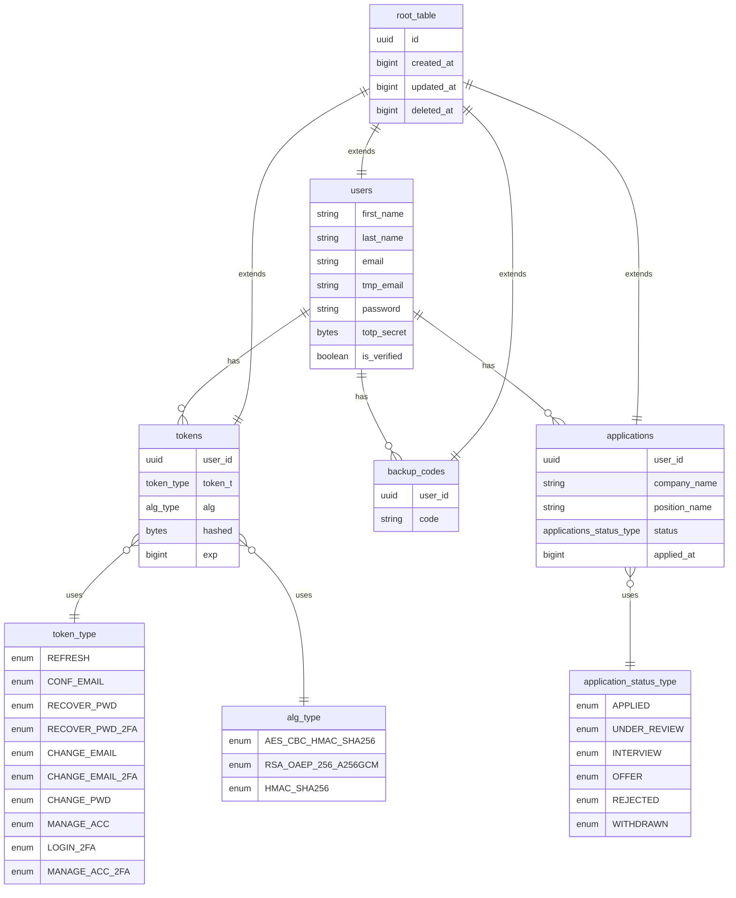

# PSN-job-application-tracker 📈

## 📌 About This Project

This app was inspired by my own job search journey. I first tracked applications in a simple notepad, but quickly realized I needed something more structured. The app was originally built with a Python backend, but I decided to rebuild it in Java since the client side was already complete and thoroughly tested with both unit and end-to-end tests. That let me fully focus on the server side while also broadening and strengthening my tech stack

---

## 🧱 Tech Stack

The name **PSN** comes from the core stack that powers the project:

- **P** → **PostgreSQL** for relational database storage
- **S** → **Spring Boot** for the backend REST API
- **N** → **Next.js (App Router)** for the client-side application

Together they form a clean, modern **full-stack architecture** 🚀

---

### 🖥️ **Client**

- **Next.js** (App Router) — Framework for React with built-in SSR, ISR, routing, and SEO optimization
- **React** + **TypeScript** — Component-based UI with static typing for maintainable, scalable front-ends
- **React Hook Form** + **Zod** — Type-safe form handling with schema-based validation
- **Redux Toolkit** + **RTK Query** — Centralized state and API caching
- **Axios** — Preconfigured HTTP client integrated with RTK Query
- **Framer Motion** — Smooth, customizable UI animations
- **Tailwind CSS** + **Sass** — Utility-first styling with support for custom, complex styles

---

### 💾 **Server**

- **Java 21** — Primary backend language
- **Spring Boot (WebFlux)** — Reactive, non-blocking backend framework powered by an **event-loop** execution model
- **Project Reactor** — Core reactive foundation powering **WebFlux**, **R2DBC**, and **Redis** for fully non-blocking data flows
- **PostgreSQL + R2DBC** — Asynchronous database access with reactive drivers
- **Liquibase** — Database migrations, written in raw SQL for full control
- **Redis (Lettuce)** — Async/reactive Redis client for caching and real-time data
- **Cloudinary (Reactive WebClient)** — Manually integrated using Spring’s WebClient, enabling fully non-blocking image and video uploads
- **JavaMailSender (MimeMessage)**— For sending HTML email content, including transactional emails built with custom, hand-crafted templates for full control over design and layout
- **Custom Python CLI Tool** — Built a Python CLI utility to automatically add dependencies to both the **TOML catalog** and **Gradle build file**, eliminating repetitive hardcoding and improving consistency in dependency management

---

### 🧪 **Testing & Quality**

- **Playwright** — End-to-end testing for UI flows
- **Vitest** — Unit testing for the client
- **JUnit Jupiter** — Unit and integration testing for the backend
- **Postman** — Manual and automated API testing
- **Checkstyle, SpotBugs, PMD** — Static analysis and code quality enforcement for Java

---

### 🛠️ **DevOps & Deployment**

- **Turborepo** — Monorepo project structure for managing client and server together, with coordinated scripts and parallel builds
- **Docker** — Ensures consistent environments for development and production across both client and server
- **Docker Hub** — Publishing and managing images
- **Kind** — Run local Kubernetes clusters for development
- **GitHub Actions** — Automated pipelines for testing, building, and deploying both apps
- **Fly.io** — Hosting platform (client and server deployed as separate services)
- **Supabase** — PostgreSQL hosting
- **Upstash** — Hosting platform for Redis
- **Brevo (SMTP)** — Outbound transactional email delivery
- **Zoho Mail** — Inbound email hosting for custom domain addresses
- **Namecheap** — Domain provider, configured with DNS records (SPF, DKIM, DMARC) to support both Brevo + Zoho
- **Zsh** — Custom shell scripts for scaffolding and developer productivity

## 📦 Setup

After cloning the repository, start by installing the dependencies:

```bash
yarn install && yarn install_pkg
```

This will initialize the project and install all required packages for both client and server.

---

### 🔒 Environment Variables

All required environment variables are listed in:

[`apps/server/app/src/main/resources/application.yml`](apps/server/app/src/main/resources/application.yml)

This file not only configures the server but also declares the environment variables required by the application.

- **Main runtime** variables are grouped under the top-level key **app**.

- **Mail service** settings are located under **spring.mail**.

- **Database connection** settings are under **spring.r2dbc**.

There’s no strict separation between client and server variables, but variables used by the client are easy to identify because **Next.js** requires them to start with **NEXT_PUBLIC**.

- **💡Note**:
  The same variables must also be present in a **kind-secrets.yml** file (not committed to git). This file is required if you want to run the app in a local **Kubernetes cluster** via **Kind**.
  A template for this file looks like:

  ```bash
  apiVersion: v1
  kind: Secret
  metadata:
  name: psn-job-application-tracker
  type: Opaque
  stringData:
  APP_NAME: "psn-job-application-tracker"
  ...rest key value pairs variables
  ```

---

### 📜 Scripts

To streamline development, I created a set of helper scripts located in the [**scripts**](scripts) folder.  
They are written in **Zsh**, so you can either copy them into your **.zshrc** file or place them wherever you normally keep custom scripts.

Available scripts:

- [`gwd`](scripts/files.zsh) — Get the monorepo’s root directory name in lowercase
- [`acw`](scripts/files.zsh) — Append `client` or `server` to the monorepo name
- [`dbc`](scripts/docker.zsh) — Build the Docker image for the client, passing build variables
- [`dbs`](scripts/docker.zsh) — Build the Docker image for the server
- [`dsi`](scripts/docker.zsh) — Start a Docker container
- [`calc_path_k`](scripts/kind.zsh) — Calculate the path of a Kind manifest dynamically, accepting the config file name and a target (`server` or `client`)
- [`kacw`](scripts/kind.zsh) — Use `calc_path_k` to apply all manifests for either the client or the server.
- [`kac`](scripts/kind.zsh) — Apply manifests to both `client` and `server`, inject `secrets` into the cluster, and start the `nginx reverse proxy`.
- [`kcc`](scripts/kind.zsh) — Create a Kind `cluster` and apply all manifest files using `kaf`
- [`ngx`](scripts/nginx.zsh) — Manage Nginx config switching via `symlink`

---

### 🛠️ Build & Run

To start a development session, run:

```bash
yarn dev
```

This command uses **Turborepo** to run both the **Java server** and the **Next.js client** in parallel:

- ☕ **Java** runs at [http://localhost:3000](http://localhost:3000)
- 🖥️ **Next.js** runs at [http://localhost:3001](http://localhost:3001)

---

To build the app, run:

```bash
yarn build
```

This triggers **Turborepo** to build both the client and server in parallel:

- ☕ **Java** compiles to bytecode and produces a `.jar` file at [apps/server/app/build/libs/server-1.0.0.jar](apps/server/app/build/libs/server-1.0.0.jar)

- 🖥️ **Next.js** follows its standard build flow, generating **SSR** or **CSR** pages depending on page configuration and data fetching logic.

---

Once the build is complete, you can start servers with:

```bash
yarn start
```

This again uses **Turborepo** to launch both the **Java server** and the **Next.js client** in parallel:

- ☕ **Python** runs at [http://localhost:3000](http://localhost:3000)
- 🖥️ **Next.js** is served at [http://localhost:3001](http://localhost:3001)

---

### 🐋 Docker

#### 🛠️ Build

To build the **client** Docker image, run:

```bash
dbc
```

---

To build the **server** Docker image, run:

```bash
dbs
```

---

#### 🐳 Start

To start a container:

- **Server**

```bash
dsi 0
```

- **Client**

```bash
dsi 1
```

---

#### 🔗 Result

- 🖥️ **Next.js** is packaged into a Docker image and served from a container at [http://localhost:3001](http://localhost:3001)
- ☕ **Java** compile to bytecode and the generated **.jar** file is run inside a container at [http://localhost:3000/api/v1](http://localhost:3000/api/v1)

---

### 🔀 Nginx Reverse Proxy

To mirror the production setup, I use an **Nginx reverse proxy** that listens on port **443 (HTTPS)** and routes requests to the correct service:

- In **development**:

  - ☕ Server → port **3000**
  - 🖥️ Client → port **3001**

- In **Kubernetes**:
  - ☕ Server → port **30080**
  - 🖥️ Client → port **30081**

This setup provides a **single HTTPS entrypoint** while internally forwarding traffic to the right service.  
It also avoids the need for a separate `kind` mode (like `PY_ENV=kind` or `NEXT_PUBLIC_ENV=kind`) — Nginx handles all routing automatically.

Configuration files can be found at [nginx](nginx)

---

#### 🚦 Root nginx.conf

Instead of hardcoding routes, the last line **include /etc/nginx/env/active.conf** acts as an entrypoint for environment-specific configs.

---

#### 🔄 Switching Between Environments

The script [`ngx`](scripts/nginx/ngx) in **scripts/nginx** manages a **symlink** (active.conf) that points to the right environment file:

- **Development** → /etc/nginx/env/dev.conf
- **Kubernetes** → /etc/nginx/env/kind.conf

---

##### Development config

Running

```bash
ngx
```

Activates dev.conf

---

##### Kind config

Running

```bash
ngx k
```

Activates kind.conf

---

### 🚢 Kubernetes

To start a local **Kubernetes Cluster** run

```bash
kcc
```

The script present in **scripts/kind.zsh** will

- **Create the cluster** using **Kind** passing the config file at repo root
- **Apply secrets** defined in **kind-secrets.yml**
- **Deploy the applications** using the manifests located in:

  - [`apps/client/kind-deploy.yml`](apps/client/kind-deploy.yml)
  - [`apps/client/kind-service.yml`](apps/client/kind-service.yml)
  - [`apps/server/kind-deploy.yml`](apps/server/kind-deploy.yml)
  - [`apps/server/kind-service.yml`](apps/server/kind-service.yml)

#### 🔗 Access

- **Client** → available at **[http://localhost:30081](http://localhost:30081)**
- **Server** → available at **[http://localhost:30080](http://localhost:30080)**

If you’ve set up the **Nginx reverse proxy** (see section above), it will automatically route these internal ports behind a single HTTPS entrypoint (port 443).

This way, your local Kubernetes environment behaves just like your development setup — URLs stay consistent and you don’t need a separate `PY_ENV=kind` or `NEXT_PUBLIC_ENV=kind` mode.

---

### ⚗️ Testing & Type Checking & Code Quality

#### ✒️ Type Checking & Code Quality

- **Client**: Formatting with **ESLint** • Type checking with **TypeScript**
- **Server**:
  - Code style enforcement with **Checkstyle**
  - Code quality checks with **PMD**
  - Bug detection with **SpotBugs**

Run:

```bash
yarn check
```

---

#### 🧪 Tests

If your development environment uses **HTTPS** (via Nginx or another proxy), you’ll need an additional set of environment variables for testing.  
These variables point the **client** and **server** directly to their respective **HTTP endpoints**, bypassing the proxy.

For this reason,`NEXT_PUBLIC_ENV` should be set to **test** when running tests.

---

Running tests directly on a Next.js app can be slow and flaky because of rebuild times.  
To improve stability and speed, the recommended workflow is:

1. **Build** the app

   ```bash
   yarn build
   ```

2. **Start** both client & server

   ```bash
   yarn start
   ```

3. **Run tests** in parallel for both client & server, using the maximum number of workers available on your machine:

   ```bash
   yarn tests
   ```

---

##### 🟧 Postman testing

A ready-to-use **Postman setup** is available at the root of the repo in the **postman directory**:

- [TEST_API.postman_collection.json](/postman/TEST_API.postman_collection.json) — Contains all API request
- [ENV_VAR.postman_environment.json](postman/ENV_VAR.postman_environment.json) — Contains the required environment variables
- [scripts](/postman/scripts/) — Contains reusable scripts used during testing to improve **efficiency**:
  - [get_tokens](/postman/scripts/get_tokens.js) — Extracts **access_token** and **cbc_hmac_token** from a response and sets them as **environment variables**.
  - [refresh_token](postman/scripts/refresh_token.js) — If a response returns status **401**, attempts to obtain a **new access_token **by calling the **refresh endpoint**.

---

**📑 Notes**:

- Variables like **email** and **pwd** are only **placeholders**. You need to configure them with your **own test credentials**.
- Variables like **URL** (for **HTTPS endpoints**) and **DEF_URL** (for **plain HTTP endpoints**) are already preset to match the **expected app configuration**, so you don’t need to change them.
- To use in Postman, click **Import → Choose Files** and select both the collection and environment JSON.
- To add the **scripts** to your **workspace**:
  1. Open a **request tab** in Postman and go to **Scripts**.
  2. Click **Packages → Open Package Library → New Package**
  3. For each file in[ /postman/scripts/](/postman/scripts/), create a **separate package** and paste its **JavaScript** code.

---

## 🐘 PostgreSQL Tables Shape



---

## 🛠️ CI/CD

The pipeline is defined in [`GitHub Workflows`](.github/workflows/check_deploy.yml) and runs automatically on every push to the **main** branch.

### 🚧 Workflow Stages

1. **Lint & Type Checking**

   - Runs `yarn check` to validate both client and server code.

2. **Tests**

   - Run `yarn test` for both client and server to ensure code quality and prevent regression.

3. **Deployment to Fly.io**

   - Client and server are hosted separately, each with its own Dockerfile.
   - **Server** is built and deployed first, ensuring it’s available for any API requests during client build.
   - **Client** is then built and deployed. Static pages that rely on API data can safely query the newly deployed server.

---

This way it:

- Ensures **zero broken builds** reach production.
- Keeps **frontend and backend deployments independent** but coordinated.
- Automates the whole dev → deploy cycle with minimal manual intervention.

---

### 🔒 Secrets Deploy

To allow GitHub Actions to deploy the app, you’ll need to configure deployment tokens and environment variables for both the **client** and **server**.

#### 🐈 GitHub Secrets

- GitHub requires the same environment variables you used in development (with adjustments for production, e.g. `NEXT_PUBLIC_ENV`, or API URLs).
- You can manage them in your repo under **Settings → Secrets and variables → Actions**.
- Alternatively, you can use the **GitHub CLI** to upload local environment variables automatically — reducing the risk of forgetting or mistyping values.

#### 🎈 Fly.io Secrets

- Fly.io also requires environment variables for deployment.
- You can set them manually in your Fly.io dashboard **(App → Settings → Secrets)**.
- Or use the **Fly CLI (`flyctl secrets set`)**, which is faster and less error-prone than updating them one by one in the dashboard.

---

Got it buddy 😎 let’s make your **Python CLI section** read smooth, professional, and clear while still keeping it developer-friendly. Here’s a polished version of what you wrote:

---

## ⚙️ Python CLI

### Working Directory

The following commands can be run directly inside the **java_pkg_cli** directory.
Alternatively, to avoid changing the directory each time, you can use the script **ja** present at [scripts/java.zsh](scripts/java.zsh) which is implemented using a **subshell** to keep directory changes isolated.

---

### Installation

To install dependencies run:

```bash
poetry install
```

---

### Build

To build the package, run:

```bash
poetry build
```

This generates two artifacts inside `dist/`:

- A **wheel (.whl)** — bundled, installable build of your code
- A **source tarball (.tar.gz)** — gzipped archive of the source code

---

### Local Installation

Install the wheel into the project’s local virtual environment (not globally or in the user’s workspace `.venv`):

```bash
poetry run pip install dist/java_pkg_cli-1.0.0-py3-none-any.whl
```

---

### Running

Once installed, you can launch the CLI with:

```bash
poetry run python -m java_pkg_cli example_group:example_artifact:1.2.3-cool_version_released i
```

### CLI Parameters

- **library** — required, `group:artifact:optional-version` format (1st positional argument)

- **config type** — optional with **i(implementation)** as default, Gradle configuration type (2nd positional argument). Examples:

  - `i` → implementation
  - `tr` → testRuntimeOnly
  - …more available via `-h`

  ```bash
  poetry run python -m java_pkg_cli -h
  ```

---

## 🪾 Branches & Commits

When looking at the **Git history**, you’ll notice a recurring pattern where each entry shows the **branch name** followed by an arrow **=>** and then the **commit message**.

For example:

```bash
recover_pwd_2FA_backup_code => validated endpoint
```

This is the convention I follow to make it obvious which branch the work came from. That way, even after I **merge** and **delete** a branch, its commits still carry a **clear trace** of their **origin**.

For clarity, I also configure Git to always create a **merge commit** (**no fast-forward** merges).
This ensures that the history explicitly shows where a branch **forked off** and where it was **merged back in**.
This makes the development process easier to follow because you can see the **“passages”** of **each feature** or fix across the **project timeline**

---

### 📑 Emoji Legend

Recently, I also started adopting an emoji system in my commits to add extra clarity:

- **⚠️ Critical** → local build works, but errors appear at **deploy** / **CI/CD**

- **📜 Docs** → documentation updates

- **🐛 Bugfix** → fixes for reported issues or errors

- **🔥 New** → new features

- **🎨 Refactor** → code cleanups / restructuring without changing behavior

- **🧪 Tests** → adding or improving test coverage

- **🛠️ Default** → normal workflow / maintenance

For example:

```bash
🪾 recover_pwd_2FA_backup_code => 🐛 fix backup_code validation

🪾 sql_root_table => 🎨 refactor method to_d to parse bytes as hex

🪾 main => 📜 updated project readme
```

I find that this style makes the **Git history** much easier to **scan quickly** and to **search** by **commit type**

---

## ✏️ Final Notes

I hope you find the project interesting — if not, the app doesn’t come with a refund policy 💰

Thanks for checking out the repo ✌🏼
