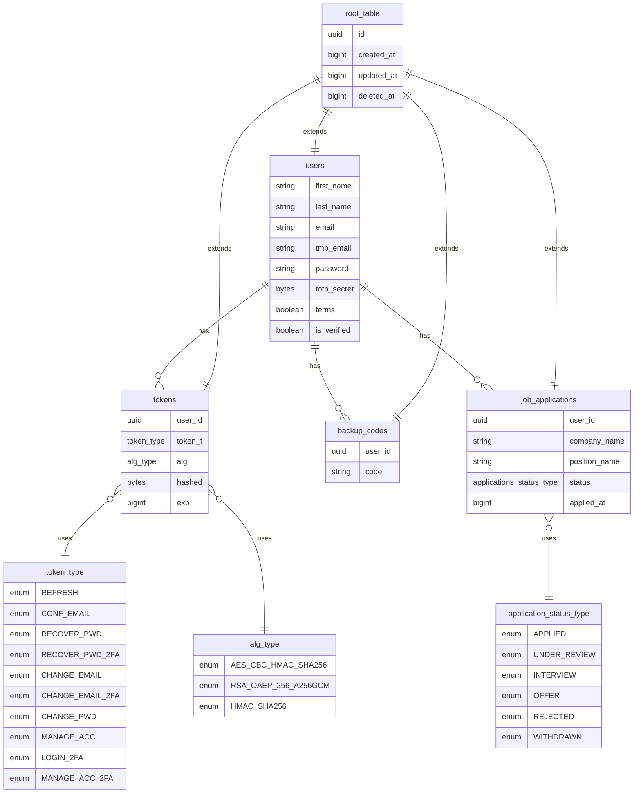

# PFN-job-application-tracker 📈

## 📌 About This Project

This app was inspired by my own job search journey — I started out tracking applications in a simple notepad, but quickly realized I needed something more structured.  
So I built a proper application to:

- Consolidate and apply the **Python tools** I’ve recently learned
- Create a practical tool that anyone can clone and use to manage their own job applications

---

## 🧱 Tech Stack

The name **PFN** comes from the core stack that powers the project:

- **P** → **PostgreSQL** for relational database storage
- **F** → **FastAPI** for the backend REST API
- **N** → **Next.js (App Router)** for the client-side application

Together they form a clean, modern **full-stack architecture** 🚀

---

### 🖥️ **Client**

- **Next.js** (App Router) — Framework for React with built-in SSR, ISR, routing, and SEO optimization
- **React** + **TypeScript** — Component-based UI with static typing for maintainable, scalable front-ends
- **React Hook Form** + **Zod** — Type-safe form handling with schema-based validation
- **Redux Toolkit** + **RTK Query** — Centralized state and API caching
- **Axios** — Preconfigured HTTP client integrated with RTK Query
- **Framer Motion** — Smooth, customizable UI animations
- **Tailwind CSS** + **Sass** — Utility-first styling with support for custom, complex styles

---

### 💾 **Server**

- **Python** `>=3.12` — Primary backend language with strong async support
- **FastAPI** — High-performance async API framework
- **SQLAlchemy** + **Alembic** — ORM and schema migrations for relational DBs
- **Pydantic** — Data validation and parsing
- **Mypy** — Static type checking for Python code quality
- **Poetry** — Dependency and environment management
- **Gunicorn** + **Uvicorn** — ASGI stack for running FastAPI in production
- **Amazon SES** — Transactional & notification email service
- **Aiosmtplib** — Async SMTP client
- **Amazon S3** — Cloud object storage for files and assets
- **Redis** — In-memory key-value store for caching, rate limiting, and temporary data
- **Argon2** — Modern memory-hard password hashing algorithm, used to securely store user passwords and protect against brute-force or GPU attacks
- **JWT** — Used as short-lived access tokens for authenticating user requests.
- **JWE** — Used as refresh tokens, securely storing session renewal data.
- **CBC-HMAC tokens with HKDF-derived keys** — Special short-lived tokens, mainly for sensitive actions like account verification, password resets, or email confirmation.
- **Fernet** — Symmetric encryption algorithm, used to securely encrypt sensitive secrets (e.g., **TOTP** seeds) before storing them in the database
- **2FA** — Implemented via **TOTP** using **PyOTP**:
  - **Secret Management** — Each user gets a **unique TOTP secret**, which is encrypted with **Fernet** before being saved in the database
  - **QR Code Enrollment** — The secret can be encoded as a QR code (**qrcode** library) so users can easily register it in an authenticator app
  - **Terminal Support** — For **CLI** users, the raw secret can also be provided directly
  - **Backup Codes** — Extra **one-time** recovery codes are generated, hashed with **Argon2**, and allow login if a **TOTP device** is **lost**
- **APScheduler** — Schedules recurring tasks

---

### 🧪 **Testing**

- **Playwright** — End-to-end testing for UI flows
- **Vitest** — Unit testing for the client
- **Pytest** — Unit and integration testing for the server
- **Postman** — API testing

---

### 🛠️ **DevOps & Deployment**

- **Turborepo** — Monorepo project structure for managing client and server together, with coordinated scripts and parallel builds
- **Docker** — Ensures consistent environments for development and production across both client and server
- **Docker Hub** — Publishing and managing images
- **Kind** — Run local Kubernetes clusters for development
- **GitHub Actions** — Automated pipelines for testing, building, and deploying both apps
- **Fly.io** — Hosting platform (client and server deployed as separate services)
- **Supabase** — PostgreSQL hosting
- **Upstash** — Hosting platform for Redis
- **Brevo (SMTP)** — Outbound transactional email deliver
- **Zoho Mail** — Inbound email hosting for custom domain addresses
- **Namecheap** — Domain provider, configured with DNS records (SPF, DKIM, DMARC) to support both Brevo + Zoho
- **Zsh** — Custom shell scripts for scaffolding and developer productivity

## 📦 Setup

After cloning the repository, start by installing the dependencies:

```bash
yarn install && yarn install_pkg
```

This will initialize the project and install all required packages for both client and server.

---

### 🔒 Environment Variables

All required environment variables are listed and validated inside:

[`apps/server/src/conf/env.py`](apps/server/src/conf/env.py)

This file uses **Pydantic** to:

- Define expected variables
- Enforce correct types
- Raise validation errors if anything is missing

This approach ensures that all variables needed by both client and server are defined in one central place — making your app easier to configure and maintain.

There’s no strict separation between client and server variables, but variables used by the client are easy to identify because **Next.js** requires them to start with **NEXT_PUBLIC**.

- **💡Note**:
  The same variables must also be present in a **kind-secrets.yml** file (not committed to git). This file is required if you want to run the app in a local **Kubernetes cluster** via **Kind**.
  Template of file is the following:

  ```bash
  apiVersion: v1
  kind: Secret
  metadata:
  name: pfn-job-application-tracker
  type: Opaque
  stringData:
  APP_NAME: "PFN-job-application-tracker"
  ...rest key value pairs variables
  ```

---

### 📜 Scripts

To streamline development, I created a set of helper scripts located in the [**scripts**](scripts) folder.  
They are written in **Zsh**, so you can either copy them into your **.zshrc** file or place them wherever you normally keep custom scripts.

Available scripts:

- [`gwd`](scripts/files.zsh) — Get the monorepo’s root directory name in lowercase
- [`acw`](scripts/files.zsh) — Append `client` or `server` to the monorepo name
- [`dbc`](scripts/docker.zsh) — Build the Docker image for the client, passing build variables
- [`dbs`](scripts/docker.zsh) — Build the Docker image for the server
- [`dsi`](scripts/docker.zsh) — Start a Docker container
- [`calc_path_k`](scripts/kind.zsh) — Calculate the path of a Kind manifest dynamically, accepting the config file name and a target (`server` or `client`)
- [`kacw`](scripts/kind.zsh) — Use `calc_path_k` to apply all manifests for either the client or the server.
- [`kac`](scripts/kind.zsh) — Apply manifests to both `client` and `server`, inject `secrets` into the cluster, and start the `nginx reverse proxy`.
- [`kcc`](scripts/kind.zsh) — Create a Kind `cluster` and apply all manifest files using `kaf`
- [`ngx`](scripts/nginx.zsh) — Manage Nginx config switching via `symlink`

---

### 🛠️ Build & Run

To start a development session, run:

```bash
yarn dev
```

This command uses **Turborepo** to run both the **Python server** and the **Next.js client** in parallel:

- 🐍 **Python** runs with **Uvicorn**, featuring **auto-reload** on `src` changes, at [http://localhost:3000](http://localhost:3000)
- 🖥️ **Next.js** runs at [http://localhost:3001](http://localhost:3001)

---

To build the app, run:

```bash
yarn build
```

This triggers **Turborepo** to build both the client and server in parallel:

- 🐍 **Python** generates both a `.tar.gz` source archive and a `.whl` (wheel) distribution package.
  The wheel file is saved inside the custom **app_wheel** folder for **local builds**.
- 🖥️ **Next.js** follows its standard build flow, generating **SSR** or **CSR** pages depending on page configuration and data fetching logic.

---

Once the build is complete, you can start servers with:

```bash
yarn start
```

This again uses **Turborepo** to launch both the **Python server** and the **Next.js client** in parallel:

- 🐍 **Python** runs via **Gunicorn**, using the **maximum available workers** on your machine, at [http://localhost:3000](http://localhost:3000)
- 🖥️ **Next.js** is served at [http://localhost:3001](http://localhost:3001)

---

### 🐋 Docker

#### 🛠️ Build

To build the **client** Docker image, run:

```bash
dbc
```

---

To build the **server** Docker image, run:

```bash
dbs
```

---

#### 🐳 Start

To start a container:

- **Server**

```bash
dsi 0
```

- **Client**

```bash
dsi 1
```

---

#### 🔗 Result

- 🖥️ **Next.js** is packaged into a Docker image and served from a container at [http://localhost:3001](http://localhost:3001)
- 🐍 **Python** is built with Poetry, installs the `.whl` package, and runs inside a container at [http://localhost:3000/api/v1](http://localhost:3000/api/v1)

---

### 🔀 Nginx Reverse Proxy

To mirror the production setup, I use an **Nginx reverse proxy** that listens on port **443 (HTTPS)** and routes requests to the correct service:

- In **development**:

  - 🐍 Server → port **3000**
  - 🖥️ Client → port **3001**

- In **Kubernetes**:
  - 🐍 Server → port **30080**
  - 🖥️ Client → port **30081**

This setup provides a **single HTTPS entrypoint** while internally forwarding traffic to the right service.  
It also avoids the need for a separate `kind` mode (like `PY_ENV=kind` or `NEXT_PUBLIC_ENV=kind`) — Nginx handles all routing automatically.

---

#### 🚦 Root nginx.conf

The main config file is:

```bash
/etc/nginx/nginx.conf

user http;
worker_processes auto;

events {
worker_connections 1024;
}

http {
include mime.types;
default_type application/octet-stream;

    sendfile on;
    keepalive_timeout 60;
    server_tokens off;

    types_hash_max_size 2048;
    types_hash_bucket_size 128;

    server {
        listen 80;
        server_name localhost;

        location / {
            return 301 https://$host$request_uri;
        }
    }

    include /etc/nginx/env/active.conf;

}
```

Instead of hardcoding routes, the last line **include /etc/nginx/env/active.conf** acts as an entrypoint for environment-specific configs.

---

#### 🔄 Switching Between Environments

The script [`ngx`](scripts/nginx/ngx) in **scripts/nginx** manages a **symlink** (active.conf) that points to the right environment file:

- **Development** → /etc/nginx/env/dev.conf
- **Kubernetes** → /etc/nginx/env/kind.conf

---

##### 🛠️ Development Config

Running

```bash
ngx
```

Activates dev.conf

```bash
server {
    listen 443 ssl;
    server_name localhost;

    client_max_body_size 200M;

    ssl_protocols TLSv1.2 TLSv1.3;
    ssl_ciphers HIGH:!aNULL:!MD5;

    access_log /var/log/nginx/access.log;
    error_log  /var/log/nginx/error.log warn;

    ssl_certificate     /etc/nginx/certs/localhost.pem;
    ssl_certificate_key /etc/nginx/certs/localhost-key.pem;

    location /api/v1/ {
        proxy_pass http://localhost:3000/api/v1/;
        proxy_http_version 1.1;
        proxy_set_header Upgrade $http_upgrade;
        proxy_set_header Connection "Upgrade";
        proxy_set_header Host $host;
        proxy_cache_bypass $http_upgrade;
    }

    location / {
        proxy_pass http://localhost:3001/;
        proxy_http_version 1.1;
        proxy_set_header Upgrade $http_upgrade;
        proxy_set_header Connection "Upgrade";
        proxy_set_header Host $host;
        proxy_cache_bypass $http_upgrade;
    }
}
```

---

##### ⚔️ Kubernetes Config

Running

```bash
ngx k
```

Activates kind.conf

```bash
server {
    listen 443 ssl;
    server_name localhost;

    client_max_body_size 200M;

    ssl_protocols TLSv1.2 TLSv1.3;
    ssl_ciphers HIGH:!aNULL:!MD5;

    access_log /var/log/nginx/access.log;
    error_log  /var/log/nginx/error.log warn;

    ssl_certificate     /etc/nginx/certs/localhost.pem;
    ssl_certificate_key /etc/nginx/certs/localhost-key.pem;

    location /api/v1/ {
        proxy_pass http://localhost:30080/api/v1/;
        proxy_http_version 1.1;
        proxy_set_header Upgrade $http_upgrade;
        proxy_set_header Connection "Upgrade";
        proxy_set_header Host $host;
        proxy_cache_bypass $http_upgrade;
    }

    location / {
        proxy_pass http://localhost:30081/;
        proxy_http_version 1.1;
        proxy_set_header Upgrade $http_upgrade;
        proxy_set_header Connection "Upgrade";
        proxy_set_header Host $host;
        proxy_cache_bypass $http_upgrade;
    }
}
```

---

### 🚢 Kubernetes

To start a local **Kubernetes Cluster** run

```bash
kcc
```

The script present in **scripts/kind.zsh** will

- **Create the cluster** using **Kind** passing the config file at repo root
- **Apply secrets** defined in **kind-secrets.yml**
- **Deploy the applications** using the manifests located in:

  - [`apps/client/kind-deploy.yml`](apps/client/kind-deploy.yml)
  - [`apps/client/kind-service.yml`](apps/client/kind-service.yml)
  - [`apps/server/kind-deploy.yml`](apps/server/kind-deploy.yml)
  - [`apps/server/kind-service.yml`](apps/server/kind-service.yml)

#### 🔗 Access

- **Client** → available at **[http://localhost:30081](http://localhost:30081)**
- **Server** → available at **[http://localhost:30080](http://localhost:30080)**

If you’ve set up the **Nginx reverse proxy** (see section above), it will automatically route these internal ports behind a single HTTPS entrypoint (port 443).

This way, your local Kubernetes environment behaves just like your development setup — URLs stay consistent and you don’t need a separate `PY_ENV=kind` or `NEXT_PUBLIC_ENV=kind` mode.

---

### ⚗️ Testing & Type Checking

#### ✒️ Type Checking

- **Client**: Formatting with **ESLint** • Type checking with **TypeScript**
- **Server**: Formatting with **Ruff** • Type checking with **Mypy**

Run:

```bash
yarn check
```

- 💡 **Note**: **Ruff** is configured to allow ambiguous variables (**E741**).
  To disallow them, remove E741 from the ignore array in **tool.ruff.lint** in [`pyproject.toml`](apps/server/pyproject.toml)

---

#### 🧪 Tests

If your development environment uses **HTTPS** (via Nginx or another proxy), you’ll need an additional set of environment variables for testing.  
These variables point the **client** and **server** directly to their respective **HTTP endpoints**, bypassing the proxy.

For this reason, both `PY_ENV` and `NEXT_PUBLIC_ENV` should be set to **test** when running tests.

---

Running tests directly on a Next.js app can be slow and flaky because of rebuild times.  
To improve stability and speed, the recommended workflow is:

1. **Build** the app

   ```bash
   yarn build
   ```

2. **Start** both client & server

   ```bash
   yarn start
   ```

3. **Run tests** in parallel for both client & server, using the maximum number of workers available on your machine:

   ```bash
   yarn tests
   ```

---

##### 🟧 Postman testing

A ready-to-use **Postman setup** is available at the root of the repo in the **postman directory**:

- [TEST_API.postman_collection.json](/postman/TEST_API.postman_collection.json) — Contains all API request
- [ENV_VAR.postman_environment.json](postman/ENV_VAR.postman_environment.json) — Contains the required environment variables
- [scripts](/postman/scripts/) — Contains reusable scripts used during testing to improve **efficiency**:
  - [get_tokens](/postman/scripts/get_tokens.js) — Extracts **access_token** and **cbc_hmac_token** from a response and sets them as **environment variables**.
  - [refresh_token](postman/scripts/refresh_token.js) — If a response returns status **401**, attempts to obtain a **new access_token **by calling the **refresh endpoint**.

---

**📑 Notes**:

- Variables like **email** and **pwd** are only **placeholders**. You need to configure them with your **own test credentials**.
- Variables like **URL** (for **HTTPS endpoints**) and **DEF_URL** (for **plain HTTP endpoints**) are already preset to match the **expected app configuration**, so you don’t need to change them.
- To use in Postman, click **Import → Choose Files** and select both the collection and environment JSON.
- To add the **scripts** to your **workspace**:
  1. Open a **request tab** in Postman and go to **Scripts**.
  2. Click **Packages → Open Package Library → New Package**
  3. For each file in[ /postman/scripts/](/postman/scripts/), create a **separate package** and paste its **JavaScript** code.

---

## 🐘 PostgreSQL Tables Shape



---

## 🛠️ CI/CD

The pipeline is defined in [`GitHub Workflows`](.github/workflows/check_deploy.yml) and runs automatically on every push to the **main** branch.

### 🚧 Workflow Stages

1. **Lint & Type Checking**

   - Runs `yarn check` to validate both client and server code.

2. **Tests**

   - Run `yarn test` for both client and server to ensure code quality and prevent regression.

3. **Deployment to Fly.io**

   - Client and server are hosted separately, each with its own Dockerfile.
   - **Server** is built and deployed first, ensuring it’s available for any API requests during client build.
   - **Client** is then built and deployed. Static pages that rely on API data can safely query the newly deployed server.

---

This way it:

- Ensures **zero broken builds** reach production.
- Keeps **frontend and backend deployments independent** but coordinated.
- Automates the whole dev → deploy cycle with minimal manual intervention.

---

### 🔒 Secrets Deploy

To allow GitHub Actions to deploy the app, you’ll need to configure deployment tokens and environment variables for both the **client** and **server**.

#### 🐈 GitHub Secrets

- GitHub requires the same environment variables you used in development (with adjustments for production, e.g. `PY_ENV`, `NEXT_PUBLIC_ENV`, or API URLs).
- You can manage them in your repo under **Settings → Secrets and variables → Actions**.
- Alternatively, you can use the **GitHub CLI** to upload local environment variables automatically — reducing the risk of forgetting or mistyping values.

#### 🎈 Fly.io Secrets

- Fly.io also requires environment variables for deployment.
- You can set them manually in your Fly.io dashboard **(App → Settings → Secrets)**.
- Or use the **Fly CLI (`flyctl secrets set`)**, which is faster and less error-prone than updating them one by one in the dashboard.

---

## 🪾 Branches & Commits

When looking at the **Git history**, you’ll notice a recurring pattern where each entry shows the **branch name** followed by an arrow **=>** and then the **commit message**.

For example:

```bash
recover_pwd_2FA_backup_code => validated endpoint
```

This is the convention I follow to make it obvious which branch the work came from. That way, even after I **merge** and **delete** a branch, its commits still carry a **clear trace** of their **origin**.

For clarity, I also configure Git to always create a **merge commit** (**no fast-forward** merges).
This ensures that the history explicitly shows where a branch **forked off** and where it was **merged back in**.
In my view, this makes the development process easier to follow because you can see the **“passages”** of **each feature** or fix across the **project timeline**

---

### 📑 Emoji Legend

Recently, I also started adopting an emoji system in my commits to add extra clarity:

- **⚠️ Critical** → local build works, but errors appear at **deploy** / **CI/CD**

- **📜 Docs** → documentation updates

- **🐛 Bugfix** → fixes for reported issues or errors

- **🔥 New** → new features

- **🎨 Refactor** → code cleanups / restructuring without changing behavior

- **🧪 Tests** → adding or improving test coverage

- **🛠️ Default** → normal workflow / maintenance

For example:

```bash
🪾 recover_pwd_2FA_backup_code => 🐛 fix backup_code validation

🪾 sql_root_table => 🎨 refactor method to_d to parse bytes as hex

🪾 main => 📜 updated project readme
```

I find that this style makes the **Git history** much easier to **scan quickly** and to **search** by **commit type**

---

## ✏️ Final Notes

I hope you find the project interesting — if not, the app doesn’t come with a refund policy 💰

Thanks for checking out the repo ✌🏼
